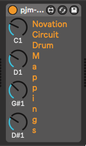

# pjm-Circuit-Drum-Mappings - Ableton Live Device to set Novation Circuit Drum Note Mappings

Translate the notes on channel 10 from 60, 62, 64, 65 - what the 
Novation Circuit devices generate for the Drum instruments - into
other notes.

The initial settings are:

- drum 1 - C1
- drum 2 - D1
- drum 3 - E1
- drum 4 - F1 